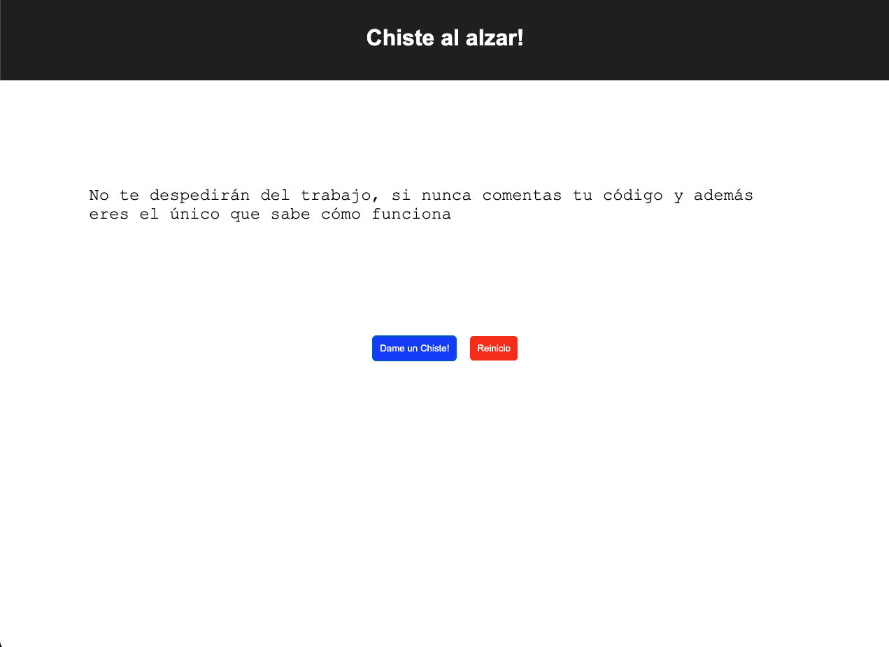

# Jokes API!

Para resolver el ejercicio necesitamos:
1. Obtener el chiste desde la URL:
``` javascript
const BASE_URL = "https://v2.jokeapi.dev/joke/Any?lang=es"
```
2. Renderizar el chiste en el HTML dependiendo de si es un "Two Part" o "Single"
    
    - Si es single, sólo deberíamos ver el chiste.

    
    
    - Si es un "Two Part" deberíamos ver la primera línea del chiste, seguido de un botón de detalle que me permita revelar la segunda parte del chiste.

    
    
    - Sólo se debe de mostrar el detalle del chiste una vez.
    
    - Cada uno de los botones debe de tener una función definida.

3. Mejorar el diseño sin afectar la funcionalidad del aplicativo. Use su creatividad. Puede utilizar librerías externas.
    
Si existen dudas al respecto del ejercicio por favor diríjanlas a través del Discord.
Adjunto dos imágenes básicas de como se ve el ejercicio final.
